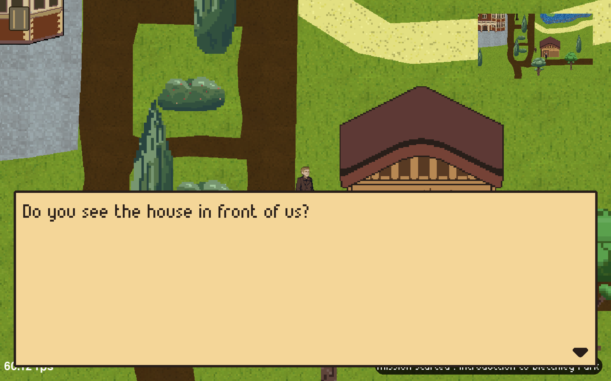
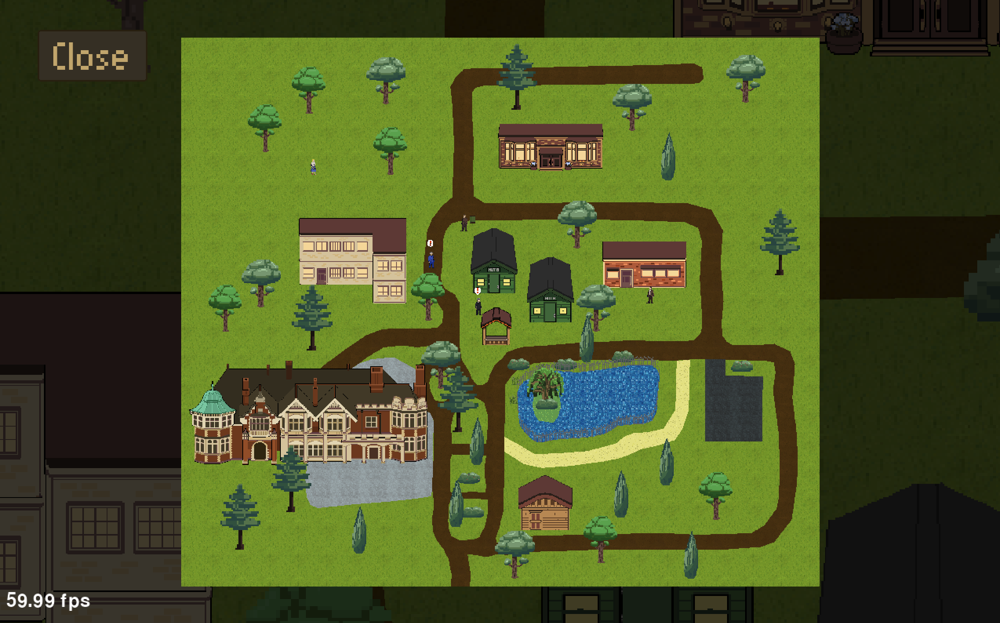
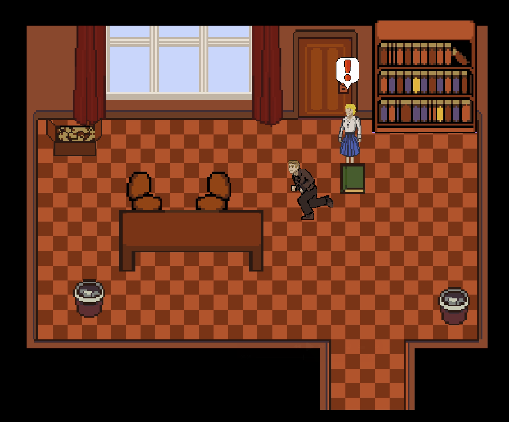
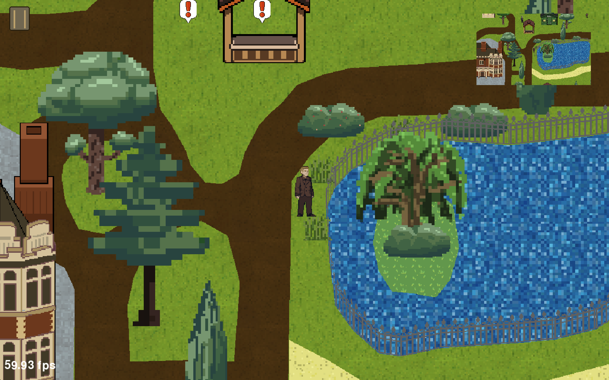

# Bletchley's Adventure

## Présentation

Bletchley’s Adventure est un jeu open world, dont le but est de contribuer à la victoire alliée de la Seconde Guerre mondiale, en décryptant des communications nazies. En travaillant à Bletchley Park, principal site de décryptage du Royaume-Uni, le joueur retourne aux origines de la cryptographie en y accomplissant diverses missions instructives qui lui permettent d’en savoir plus sur cette discipline en évoquant des systèmes tels que Enigma ou la Bombe, tout en conservant un aspect ludique.

*Pour plus d'information, lisez notre [documentation officielle](docs/README.md) !* \
*Pour savoir comment jouer à notre jeu, lisez notre [guide utilisateur](docs/user_guide.md) !*

## Quelques exemples

> \
> *Joueur en pleine **discussion***

> \
> *La __carte__ principale de Bletchley's Adventure*

> \
> *Vue __intérieure__ d'un bâtiment*

> \
> *Exemple de l'expérience de jeu*
