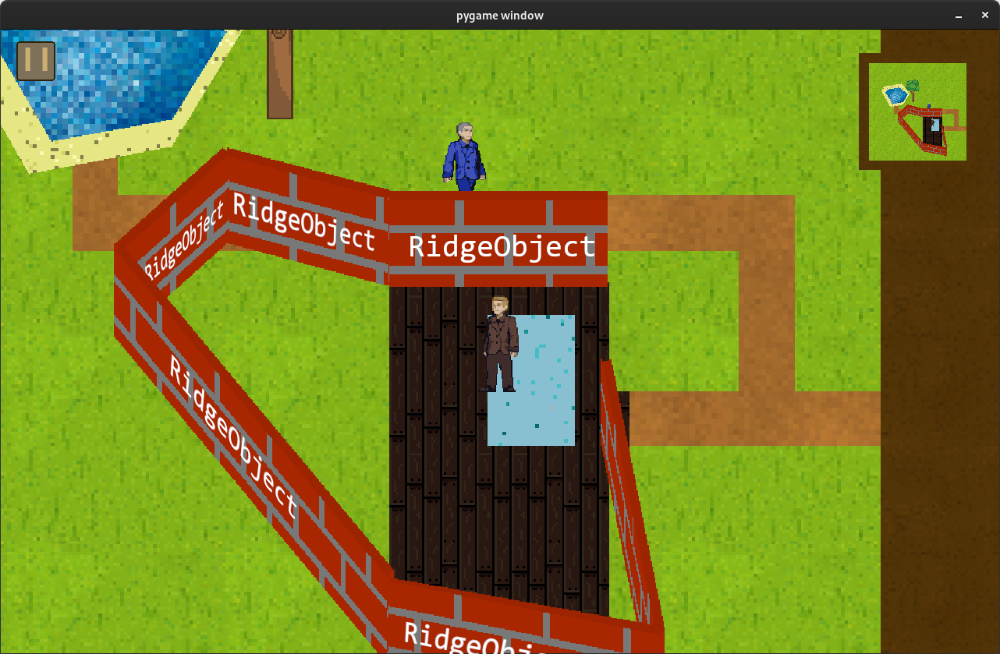

# `RidgeObject` - arête de mur
## Description
### Hérite de : `MapObject`
Cette classe représente une arête de mur.

Elle implémente une méthode permettant de déterminer 
si elle doit se placer au-dessus ou au-dessous.

Elle contient un attribut contenant son type pour permettre de calculer son placement en fonction du type
de l'autre objet.

> \
> *Exemple **annoté** d'arête de mur.*
## Attribut
- `object_type` : *`str`* = `'ridge'` **get**
## Méthodes
- `__init__(data)` &rarr; `None` \
  Initialise `MapObject` avec `data`. \
  Paramètre : 
  * `data` : *`dict`* \
    Données d'initialisation.

- `goes_on_top_of(map_object)` &rarr; `bool` \
  Indique si cet objet se place au-dessus de `map_object`. \
  Paramètre :
  * `map_object` : *`MapObject`*

- `closest_vector_to_segment(vector1, vector2)` &rarr; `Vector2` \
  Détermine le vecteur le plus court d'un segment à un autre. \
  Paramètres : 
  * `vector1` : *`Vector2`*
  * `vector2` : *`Vector2`*
