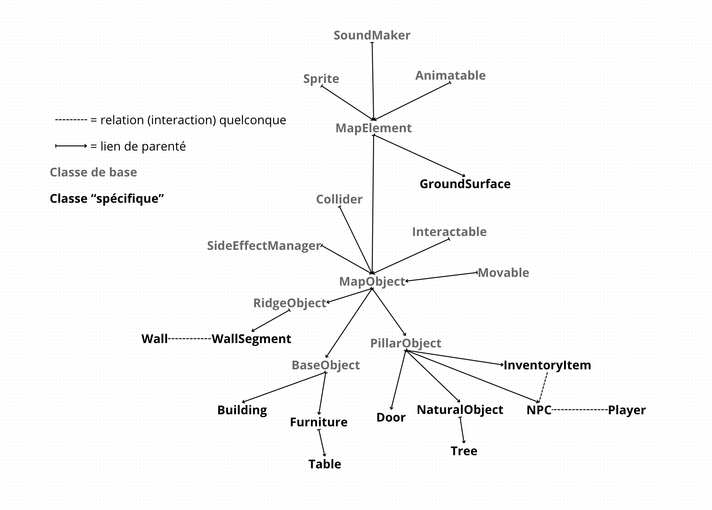

# Documentation

## Introduction

Le jeu est programmé en python 3, il utilise pour seul bibliothèque externe `PyGame`, comme spécifié dans les [`requirements.txt`](../requirements.txt). Il est entièrement fait en Programmation Orienté Objet (POO) afin de garantir une structure solide malgré la taille conséquente du code.

Le point d'entrée du jeu se trouve dans le fichier [`main.py`](../sources/main.py). Ce fichier initialise `PyGame` et les différents singletons du jeu, puis les passe dans la surcharge de [`GameLoop`](utils/game_loop.md). Cette classe fait tourner la boucle de jeu, c'est elle qui coordonne toutes les autres et qui met à jour l'état de toute l'application à chaque nouveau rendu.

Le jeu est séparé en différent singletons, des classes dont il ne peut y avoir qu'une seule instance. Elles régissent la totalité du jeu en fournissant des interface simple d'utilisation à plusieurs fonctionnalités. Par exemple, [`DataHandler`](utils/data_handler.md) en est un, et **toutes** les informations extérieures au code, que ce soit des images ou des données sous format json passe par cette classe. Ses méthodes rendent l'intéraction avec les données beaucoup plus simple pour le reste de l'application, il est donc à l'origine du système de sauvegarde. [`ControlHandler`](utils/control_handler.md) lui traite les entrées utilisateurs, clavier et souris tandis que [`TimeHandler`](utils/time_handler.md) traite de la gestion du temps, il permet de mesurer des durées ou encore de savoir combien de temps s'est écoulé depuis le dernier rendu.

**Voici la liste des autres classes de ce genre :**

- [`SoundMixer`](utils/sound_mixer.md) gère le son, c'est le référent pour jouer des sons, il permet aux autres classes de jouer des sons ambiants, de la musique, ou encore des effets sonores pour communiquer des informations à l'utilisateur.
- [`SoundTrack`](utils/sound_track.md) est l'unité des sons ambiants, certains objets du jeu peuvent produire des sons ambiants, comme des bruits de pas pour les personnages, ils auront donc un `SoundTrack` représentant les bruits de pas.
- [`Vector2`](utils/vector_2.md) est présent partout, il représente un vecteur sur le plan (0, x, y) et sert littéralement partout lorsqu'il faut mesurer une longueur. Ses méthodes poussées fait de lui un choix de taille.
- [`MenuHandler`](utils/menu_handler.md) est l'interface de communication avec tout le système de l'interface graphique, il permet la création et la suppression dynamique de boutons et d'éléments graphiques, il est aussi à l'origine du système de pagination de l'application.
- [`Camera`](utils/camera.md) permet l'affichage à l'écran de `PyGame` de manière intelligente, il intègre un système d'écran séparé afin que l'affichage de l'application se fasse sur plusieurs dimensions.
- [`LogHandler`](utils/log_handler.md) gère le mode développement, plus d'information sur [le guide utilisateur](user_guide.md) pour savoir comment l'activer.
- [`Player`](utils/player.md) représente le joueur à un niveau plus abstrait, le `Player` contrôle un PNJ, qui devient alors le joueur, cette classe sert alors de point d'accès au personnage du joueur.
- [`MissionHandler`](utils/mission_handler.md) gère l'affichage et l'exécution de missions dans le jeu, pour nous permettre d'avoir un mode histoire.

Ainsi, ces classes sont le liant de l'application, qui lient les différentes parties les unes entre elles. Maintenant, plongeons nous plus en profondeur dans les différentes couches de notre application.

## L'interface graphique

L'interface graphique est découpé en [`Menu`](ui/menu.md), qui sont gérés par [`MenuHandler`](utils/menu_handler.md) donc. Par `Menu`, on peut entendre page, et c'est exactement ce que c'est. Un menu est une couche d'éléments graphiques, ayant chacun ses propriétés. Les menus sont donc indépendants les uns des autres et peuvent être changé à tout moment dans l'application via `MenuHandler`.

Chaque élément d'un menu étend la classe [`UIElement`](ui/ui_element.md), cela peut être un fond de couleur, du texte, une image, un bouton ou encore un champ de texte.
Un `UIElement` a des propriétés de bases, commun à tous les autres, comme un position et des dimensions, vous trouverez plus d'informations dans sa référence.

Ces éléments peuvent être manipulé dynamiquement depuis le code python, mais aussi créés depuis l'initialisation même du jeu.
Tous les menus et éléments immuables de l'application sont définis dans le fichier [`data/menus_info.json`](../data/menus_info.json).

Analysons-le un petit peu :
la première propriété `"initial_menu"` définit tout naturellement le menu initiale du jeu, celui qu'on voit lorsque le jeu démarre. Ensuite nous voyons `"classes"` et `"menus"`, dans ces dictionnaires vous pourrez créer respectivement des classes (hérités du CSS) et des menus (on vient de les voir), je vous renvoie une dernière fois sur la référence de `UIElement` pour en savoir plus.

## Le système de mission

Les missions sont représentées par [`Mission`](world/basics/mission.md). Dans la logique, une mission est constitué de plusieurs objectifs, les objectifs sont des fonctions simples exécutés à chaque rendu tant que ce dernier n'est pas complété comme aller quelque part, effectuer un dialogue, suivre un personnage, ou alors cela peut être plus compliqué comme lorsque l'on parle des résolutions d'énigmes plus complexes. Comme chaque objectif est une fonction, elles renvoient un nombre, soit `1` = on passe à l'objectif suivant s'il y en a un, sinon la mission est réussie, soit `0` = la fonction de l'objectif sera réexécuté au prochain rendu, soit `-1` = la mission est échouée, il faut tout recommencer.

> ```python
> def objectif_recuperer_un_objet(self):
> 	inventory = Player().get_focus().get_inventory()
> 	if inventory is not None and inventory.get_name() == 'nom_de_l_objet':
> 		return 1
> 	else:
> 		return 0
> ```
> Exemple d'objectif

Dans cet exemple, nous manipulons le singleton [`Player`](utils/player.md) afin de savoir si le joueur a un objet dans son inventaire et si c'est celui qu'on veut, si oui, l'objectif est réussi, sinon il est encore en cours.

## Le monde du jeu

Cette partie concerne l'ensemble des classes contribuant à créer l'Open World. La grande classe de cette partie est sans doute [`Map`](world/specific/map.md). Agissant comme [`Menu`](ui/menu.md) pour l'interface graphique, `Map` est un conteneur régissant les règles du jeu et le faisant évoluer de manière contrôlée afin d'éviter les bugs. Elle met pour cela à disposition tout un ensemble de méthode permettant de manipuler dynamiquement les objets à l'intérieur de cell-ci ; on y compte des méthodes de recherches, d'addition et de suppression d'objets.

Le reste des classes constituant cette section peut être sindé en deux parties.

### Les classes de bases

Ce qu'on entend par ce terme sont toutes les classes sous-jacentes à celle qu'on voit. Par exemple, si on prend un PNJ, il peut se déplacer, émettre des sons, être animé et affiché à l'écran. Toutes ces fonctionnalités au sein de cette objet tirent respectivement leur origine dans les classes parent [`Movable`](world/basics/movable.md), [`SoundMaker`](world/basics/sound_maker.md), [`Animatable`](world/basics/animatable.md) et [`Sprite`](world/basics/sprite.md). Ces dernières sont des classes abstraites, elles ne peuvent pas être créées et implémentées dans le jeu telles quelle.

### Les classes spécifiques

Les classes "spécifiques" sont celles implémentables directement dans le jeu, à l'inverse des classes de base. Parmi elles, on compte [`NPC`](world/specific/npc.md) ou encore [`Tree`](world/specific/tree.md). Elles ont leurs propres logiques et leur propre fonctionnement. Je ramène sur leurs références respectives pour en savoir plus.

### Conclusion

Pour manipuler et créer ce dernier type de classe, on peut soit passer par les méthodes de [`Map`](world/specific/map.md), soit les renseigner dans [`data/backups/new_game_backup.json`](../data/backups/new_game_backup.json). on y trouve les différentes cartes dans la propriété `"maps"`, et leurs éléments respectifs.

>  \
> Schéma représentatif de l'architecture des différentes classes

# Références

- Classes dans [`utils`](../sources/src/utils/README.md), les singletons :
    * [`GameLoop`](utils/game_loop.md)
    * [`DataHandler`](utils/data_handler.md)
    * [`ControlHandler`](utils/control_handler.md)
    * [`Camera`](utils/camera.md)
    * [`LogHandler`](utils/log_handler.md)
    * [`MenuHandler`](utils/menu_handler.md)
    * [`MissionHandler`](utils/mission_handler.md)
    * [`Player`](utils/player.md)
    * [`Vector2`](utils/vector_2.md)

- Classes dans [`ui`](../sources/src/ui/README.md), l'interface graphique :
    * [`Menu`](ui/menu.md)
    * [`UIElement`](ui/ui_element.md)
    * [`Button`](ui/button.md) \
    *Classe associée : [`ButtonActions`](ui/button_actions.md)*
    * [`Dialog`](ui/dialog.md)
    * [`Marker`](ui/marker.md)
    * [`MiniMap`](ui/mini_map.md)
    * [`FPSHelper`](ui/fps_helper.md)
    * [`Line`](ui/line.md)
    * [`TextInput`](ui/text_input.md)
    * [`KeybindInput`](ui/keybind_input.md)
    * [`SavingInput`](ui/saving_input.md)
    * [`Slider`](ui/slider.md) \
    *Classe associée : [`SliderActions`](ui/slider_actions.md)*

- Classes dans [`world/basics`](../sources/src/world/basics/README.md), les classes de base du monde :
    * [`Mission`](world/basics/mission.md) \
    *Classe associée : [`Missions`](world/basics/missions.md)*
    * [`Sprite`](world/basics/sprite.md)
    * [`Animatable`](world/basics/animatable.md)
    * [`Interactable`](world/basics/interactable.md)
    * [`Collider`](world/basics/collider.md)
    * [`SoundMaker`](world/basics/sound_maker.md)
    * [`SideEffectManager`](world/basics/side_effects_manager.md)
    *Classe associée : [`SideEffects`](world/basics/side_effects.md)*
    * [`Movable`](world/basics/movable.md)
    * [`MapElement`](world/basics/map_element.md)
    * [`MapObject`](world/basics/map_object.md)
    * [`RidgeObject`](world/basics/ridge_object.md)
    * [`BaseObject`](world/basics/base_object.md)
    * [`PillarObject`](world/basics/pillar_object.md)

- Classes dans [`world/specific`](../sources/src/world/specific/README.md), les classes implémentable du monde :
    * [`Map`](world/specific/map.md)
    * [`NPC`](world/specific/npc.md) \
    *Classe associée : [`PatternEvents`](world/specific/pattern_events.md)*
    * [`InventoryItem`](world/specific/inventory_item.md)
    * [`Wall`](world/specific/wall.md) \
    *Classe associée : [`WallSegment`](world/specific/wall_segment.md)*
    * [`GroundSurface`](world/specific/ground_surface.md)
    * [`Interior`](world/specific/interior.md)
    * [`Building`](world/specific/building.md)
    * [`Door`](world/specific/door.md)
    * [`NaturalObject`](world/specific/natural_object.md)
    * [`Tree`](world/specific/tree.md)
    * [`Furniture`](world/specific/furniture.md)
    * [`Table`](world/specific/table.md)
