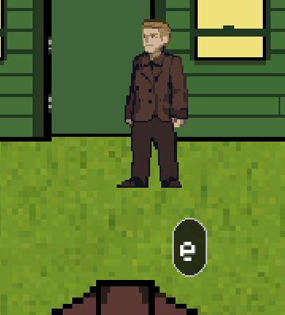

# Le guide utilisateur

## Les déplacements

Pour se déplacer, rien de plus simple :
- `z` pour aller vers le haut.
- `q` vers la gauche.
- `d` vers la droite.
- `s` vers le bas.

## Interagir

En jouant au jeu, vous aurez l'occasion d'interagir avec des personnages ou des objets.
La touche d'interaction, `e` par défaut, devrait s'afficher comme ceci :

>  \
> Interaction proposée dans cet exemple : entrer dans le bâtiment via la porte

## Utiliser l'inventaire

Vous aurez l'occasion d'apercevoir des objets posés au sol ou sur une table, si vous vous approchez, vous pourrez les prendre avec `r` comme indiqué sur l'écran :

>  \
> Le jeu propose au joueur de prendre la lettre située sur la table

Une fois la lettre prise, elle est dans votre inventaire. Vous ne pouvez prendre qu'un seul item à la fois. Cela devrait ressembler à ça :

>  \
> Le joueur a une lettre dans son inventaire

Si vous souhaitez reposer l'item sur le sol, il vous suffit d'appuyer encore une fois sur `r`. Si vous êtes dans le rayon de 100 pixels d'un emplacement d'item prévu sur une table, l'item se déposera sur la table.
*Remarque : certaines tables peuvent recevoir des items dessus, elles ont alors des emplacements prédéfinis pour recevoir ces items.*

## Reconnaître les missions

Les missions sont marqués par un point d'exclamation au-dessus de la tête du personnage qui vous propose la mission. Il vous suffira d'interagir avec lui pour démarrer la mission.

>  \
> Le joueur a la possibilité de commencer une mission

## Gérer les dialogues

lorsque vous êtes dans un dialogue, vous pouvez appuyer sur `Entrée` ou la flèche du bas une fois que le message s'est affiché entièrement pour passer au suivant.
Si vous souhaitez passer le dialogue complètement, appuyez sur `Tab` à n'importe quel moment même si cela est déconseillé pour une bonne compréhensions de l'hisoire.

>  \
> Exemple de dialogue

## Se repérer dans une mission

Lorsqu'une mission est en cours, vous pouvez savoir le nom de la mission et ce que vous devez faire afin de la compléter.

>  \
> L'objectif en cours

Si vous échouez la mission, ou si vous revenez au menu principal pendant qu'une mission est en cours, le jeu revient à l'état d'avant que la mission ait commencé et vous devriez apercevoir cet écran de chargement

>  \
> Écran de chargement

*Remarque : les sauvegardes ne sont pas autorisées lorsqu'une mission est en cours.*

Un dernier point : les missions les plus palpitantes du jeu sont en sauvegardes manuelles présentes par défaut, plus besoin de jouer des heures avant de tomber sur quelque chose d'intéressant ! Il suffit de cliquer sur `Load Game` dans le menu principale pour choisir laquelle charger.

## Les sauvegardes

Des sauvegardes automatiques sont faites à chaque fois que le déplacement de votre personnage est significatif, à chaque fois que vous changez de carte, que vous terminez une mission et que vous retournez au menu principal.

Pour sauvegarder manuellement, il vous suffit de cliquer sur le bouton correspondant dans le menu de pause et d'entrer le nom de votre sauvegarde, valider votre saisie en appuyant sur `Entrée` ou sur le bouton `Save`. Si le jeu a réussi la sauvegarde de votre partie, le champ de texte devrait se vider, sinon vous avez probablement utilisé un charactère interdit lorsqu'il s'agit de nommer les fichiers. *Faites attention.*

## Les réglages

Dans le menu de pause, vous aurez l'occasion de changer vos touches, le volume de la musique, ou encore d'autres paramètres.

>  \
> Menu des réglages

*Remarque : les `Key Bindings` sont actualisés et sauvegardés dès lors que vous les modifiez, vous pouvez également les réinitialiser. Ces mêmes réglages sont sauvegardés en même temps que le jeu, donc attention lorsque vous chargez des sauvegardes manuelles ou lorsque vous commencez une nouvelle partie, car vos réglages pourraient changer.*

## Les raccourcis clavier

Lorsque vous êtes dans le jeu, vous pouvez ouvrir le menu pause et en sortir avec `esc`, vous pouvez faire de même pour ouvrire et fermer la carte en appuyant sur `m`.

## Activer le mode développement

Si vous souhaitez basculer en mode développement, il vous faudra aller dans [`sources/src/__init__.py`](../sources/src/__init__.py), à la ligne 2, changez la variable `DEBUG` pour la mettre à *`True`*, puis relancez votre jeu. Vous devriez avoir un menu qui ressemble à ça :

>  \
> Jeu en mode développement

Plus d'information sur la référence de [`LogHandler`](utils/log_handler.md).
