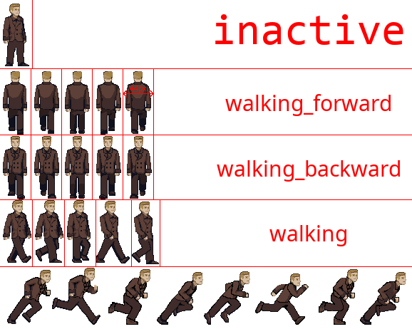

# `Animatable` - gestion de l'animation
## Description
Cette classe est nécessaire aux classes enfant pour avoir une animation.

Elle permet d'afficher une ou plusieurs animations, en mettant à jour au cours du temps l'image affichée.
Elle permet aussi d'émettre un son optionnellement si elle est couplée à `SoundMaker`.

Elle exploite une image contenant une matrice d'images, avec une ligne par animation et une colonne par image d'animation (*frame*).

> \
> *Exemple **annoté** d'image d'animation.*

Les informations de l'animation sont présentes dans le fichier `info.json` associé. Chaque entrée du dictionnaire des animations représente une ligne de l'image et chaque entrée du tableau `widths` représente une *frame* de l'animation. 
> ```json
> {
> 	"animations": {
> 		"inactive": {
> 			"widths":[
> 				{ "width": 44, "time": 1000 }
> 			],
> 			"height": 93
> 		},
> 		"walking_forward": {
> 			"widths": [
> 				{ "width": 43, "time": 0.2 },
> 				{ "width": 43, "time": 0.2 },
> 				{ "width": 43, "time": 0.2 },
> 				{ "width": 43, "time": 0.2 },
> 				{ "width": 43, "time": 0.2 }
> 			],
> 			"height": 95
> 		},
>         ...
> 	}
> }
> ```
> *Exemple de fichier `info.json`*

## Attributs
- `animation_running` : *`bool`* \
  Indique si l'animation tourne.
- `frame_index` : *`int`* \
  Index de la *frame* actuelle.
- `infinite` : *`bool`*
- `animation_name` : *`str`*
- `dt` : *`float`* \
  &Delta;t : temps depuis la dernière mise à jour de l'animation.
- `animation_sound_name` : *`str`* \
  Nom du son à jouer pendant l'animation.
- `image_path` : *`str`*
- `animations` : *`dict`* \
  Informations sur les différentes animations, chargées depuis `info.json`.

## Méthodes
- `__init__(position, image_path)` &rarr; `None` \
  Initialise les attributs. \
  Paramètre :
  * `image_path` : *`str`* \
    Chemin de l'image à charger.
- `set_animation_sound_name(sound_name)` &rarr; `None` \
  Change ou arrête **manuellement** le son de l'animation en cours. \
  Paramètres :
  * `sound_name` : *`str`*
- `change_animation(animation_name, force)` &rarr; `None` \
  Change l'animation en cours vers une animation différente.
  Paramètres :
  * `animation_name` : *`str`*
  * `force` : *`bool`* \
  Force le changement même si l'animation cible est celle en cours.
- `stop_animation()` &rarr; `None` \
  Arrête l'animation en cours.
- `resume_animation()` &rarr; `None` \
  Reprend l'animation précédemment arrêtée.
- `reset_animation_state()` &rarr; `None` \
  Remet l'animation en cours à zéro.
- `update_index_animation()` &rarr; `None` \
  Méthode exécutée à chaque rafraîchissement du jeu, permet de mettre à jour l'état de l'animation.
- `update()` &rarr; None \
  Alias de `update_index_animation()`.