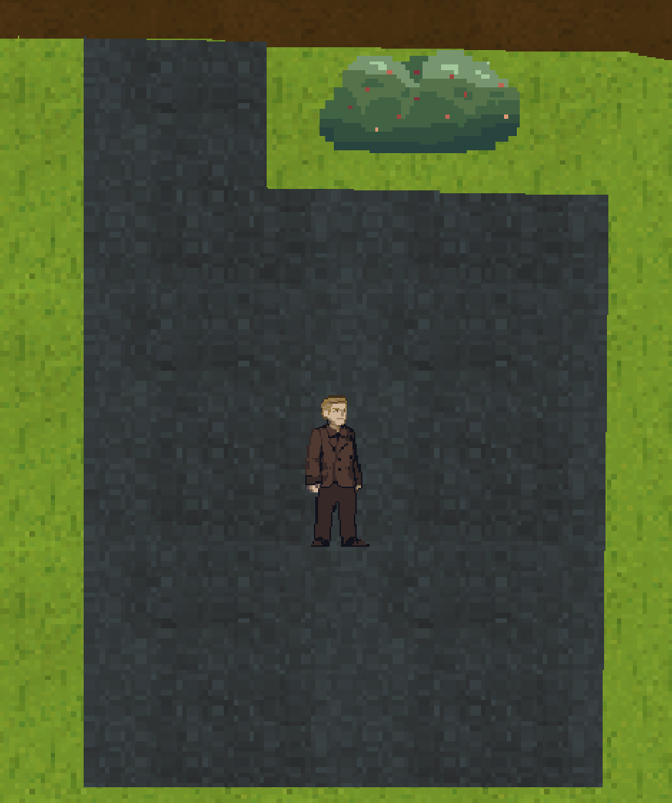

# `GroundSurface` - Le sol.

## Description

Pour la faire simple, cette classe se matérialise par un polygône de texture. Ainsi cela représente le sol.

Pour accompagner le tout, dans les données de l'image du sol, on peut préciser un `ground_type` via la propriété `"type"`. Cela représente le son produit par un personnage lorsqu'il marche dessus.

Le sol peut masquer son contenu si le joueur n'a pas le niveau requis, il se trouve que ce système n'est pas utilisé dans notre jeu

les sommets du polygône sont représentés par la propriété `"boundaries"` dans `data`, le dictionnaire d'initialisation de la classe.``
*Exemple :*

> ```json
> {
> 	"type": "GroundSurface",
> 	"name": "background",
> 	"image_path": "grass_1",
> 	"boundaries": [[-620, -100], [2750, -100], [2750, 2795], [-620, 2795]]
> }
> ```
> Exemple de création d'un `GroundSurface`.

Un autre exemple mais cette fois-ci en image :

> 
> Exemple de rendu d'un `GroundSurface`.

## Attributs
- `boundaries` : *`list[Vector2]`* \
  Les coordonnées du sol
- `required_level` : *`int`* \
  Le niveau requis pour voir le sol.
- `does_player_see` : *`bool`* \
  Indique si le joueur a l'autorisation de voir le sol.
- `access_overlay` : *`pygame.Surface`* \
  le filtre noir par dessus le sol si le joueur ne peut pas le voir.
- `ground_type` : *`str`* **get**  \
  Le son que produit le sol à la marche.

## Méthodes
- `__init__(data)` &rarr; `None` \
  Initialise la classe parent, l'image, la position et les autres propriétés.
  Paramètre :
  * `data` : *`dict`*

- `update()` &rarr; `None` \
  Gère l'état de `does_player_see`.

- `render()` &rarr; `None` \
  si l'objet est rendu à l'écran, rendre `access_overlay`.

- `get_data()` &rarr; `dict` \
  Renvoie les données de la classe parent en enlevant la position pour ne éviter de sauvegarder des données inutiles.
