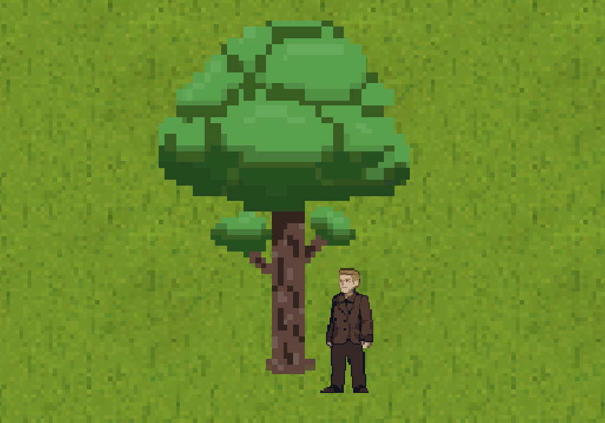

# `Tree` - Des arbres pour se sentir bien

## Description

Cette classe est nécessaire pour pouvoir avoir des arbres.

Elle est assez simple, c'est un [`PillarObject`](../basics/pillar_object.md), avec cependant une valeur par défaut pour la `hitbox`, initiée à `(0 ; 0)`, ce qui correspond au tronc de l'arbre. le `hitbox_action_radius` a une valeur par défaut à `30px` pour permettre des collisions avec plus de portée.

Tout de suite, pour nous détendre, une image d'un arbre :

> 
> Image d'un `Tree`

## Attributs
> hérités des classes parent

## Méthodes
- `__init__(data)` &rarr; `None` \
  Initialise la classe parent ainsi que les valeurs par défaut pour `hitbox` et `hitbox_action_radius`. \
  Paramètre :
  * `data` : *`dict`* \
  Le dictionnaire d'initialisation de l'arbre.

- `render()` &rarr; `None` \
  Fais correspondre la position de l'arbre avec son tronc.
