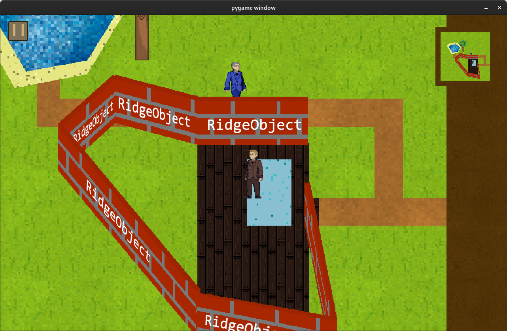
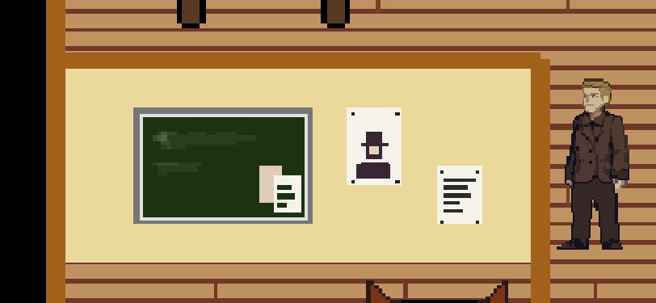

# `WalSegment` - Une façade de mur

## Description

Cette classe est nécessaire pour pouvoir avoir des murs dans le jeu et ainsi donner plus de réalisme.

Son rôle en soit est simple : recréer l'image d'un mur avec une fausse 3D et l'intégrer au jeu avec la bonne `hitbox` et `position`. \
Pour cela, il manipuler des effets de cisaillement et de *scale* pour avoir un semblant de 3D sur la face principale, celle de coupe, et celle du dessus.

Il faut donc 3 textures différentes pour ces 3 faces nommées respectivement `front`, `side` et `top`. \
Elles sont définies dans les données de l'image du mur. \
*Exemple :*

> ```json
> {
> 	"height": 100,
> 	"width": 10,
> 	"images": {
> 		"front": "front",
> 		"side": "side",
> 		"top": "top"
> 	}
> }
> ```
> Exemple de données d'image.

Ici, dans `"images"`, les clés correspondent aux faces choisies et les valeurs correspondent aux nom des images, il y a donc `front.png`, `side.png` et `top.png`.

Une fois ces 3 textures acquises, pour faire la fausse 3D, il a fallu, pour chacune des 3 faces, leur appliquer un redimensionnement (réduire leur largeur et non leur hauteur pour être plus précis) ainsi qu'un cisaillement qui pourrait imiter une projection isométrique.

*Exemple :*

> 
> **Mur**

Ici, nous pouvons clairement discerner les trois faces transformées.

Ensuite, les murs prennent en charge un système de `stickers`. Réglables dans `boundaries` les stickers permettent de coller des irrégularités sur les murs.

*Exemple :*



Pour réaliser ceci, les données à renseigner dans `boundaries` se présentent sous cette forme :

> ```json
> {
> 	...
> 	"boundaries": [[0, 900], [0, 0], { "sticker": "door_wood", "x_offset" : 35 }, [1000, 0]]
> }
> ```
> Exemple de sticker dans `boundaries`.

## Attributs
- `wall_type` : *`str`* \
  Le type de mur, a.k.a. l'image du mur.
- `wall_height` : *`int`* \
  Le hauteur du mur en px.
- `wall_width` : *`int`* \
  La largeur du mur en px, si égale à 0, le mur est invisible.
- `boundaries` : *`list[Vector2]`* \
  Le segment du mur, donc 2 points.
- `stickers` : *`list[dict]`* \
  La liste de tous les stickers à coller sur le mur.
- `original_front_image` : *`pygame.Surface`* \
  L'image telle qu'elle a été chargée.
- `front_image_perspective` : *`pygame.Surface`* \
  L'image en perspective.
- `original_side_image` : *`pygame.Surface`* \
  L'image telle qu'elle a été chargée.
- `side_image_perspective` : *`pygame.Surface`* \
  L'image en perspective.
- `original_top_image` : *`pygame.Surface`* \
  L'image telle qu'elle a été chargée.
- `top_image_perspective` : *`pygame.Surface`* \
  L'image en perspective.
- `p1_to_p2` : *`Vector2`* \
  Vecteur allant du premier point du segment jusqu'au second.
- `direction` : *`bool`* \
  Indique dans quelle direction est le mur : pointe-t-il en haut à gauche ou en haut à droite ?

## Méthodes
- `__init__(data)` &rarr; `None` \
  Initialise la classe parent, et calcule `image` en créant la fausse 3D (appelle `calculate_wall_image()`). \
  Paramètre :
  * `data` : *`dict`* \
  Le dictionnaire d'initialisation du mur.

- `calculate_front_image_perspective()` &rarr; `None` \
  Calcule `front_image_perspective`, se charge également d'appliquer les stickers.

- `calculate_side_image_perspective()` &rarr; `None` \
  Calcule `side_image_perspective`.

- `calculate_top_image_perspective()` &rarr; `None` \
  Calcule `top_image_perspective`.

- `calculate_wall_image()` &rarr; `None` \
  Appelle les 3 méthodes ci-dessus et colle les résultats sur `image`.

- `render()` &rarr; `None` \
  Rend le mur en faisant en sorte de régler la position de manière habile pour que la `hitbox` correspondent avec ce que l'on voit à l'écran.

- `get_data()` &rarr; `None` \
  Retourne *`None`* car on ne veut pas que les `WallSegment` soient sauvegardés, ils doivent forcément être crée par un [`Wall`](wall.md).
  